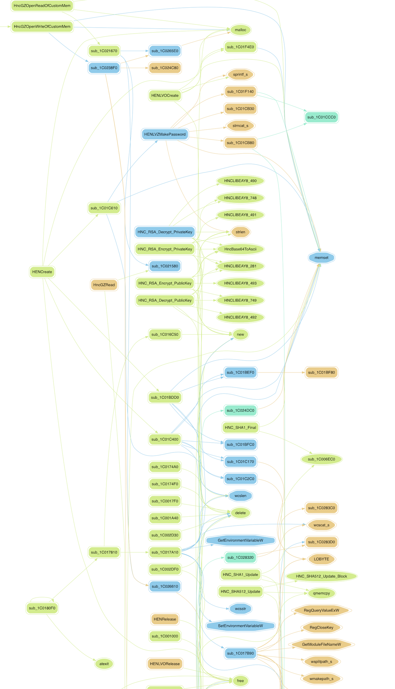
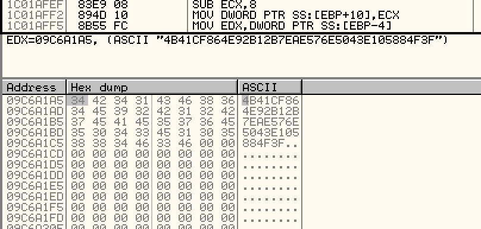
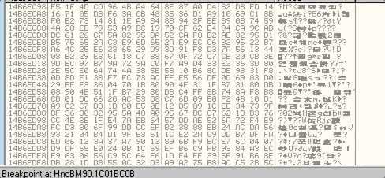

# Hwp 암호화(어려움) 분석

삽질을 해보면서 찾아본 결과, HncBM90.dll에 HEN 암호화 함수가 정의되어 있는 것을 확인했습니다. HncBM90.dll을 분석해보겠습니다.

## HncBM90.dll

아래는 HncBM90.dll의 flow chart 중 일부입니다.



HENCreate가 키 값 암호화의 핵심 부분이며, 4번 반복되면서 콘텐츠 암호화에 필요한 key를 생성합니다.



위는 암호화된 키 값을 캡처한 화면입니다.

키는 커스텀 암호화를 거쳐서 생성됩니다. (추측이지만 `HEN(HwpENcrypt)`이 암호화 방식의 이름인 것 같습니다.)

```c
char *__stdcall HENReadBlock(_DWORD *key_space, char *encrypted_space, int a3)
{
  char *result; // eax

  if ( *key_space == 4 )
    result = crypt_difficult_1C01BBF0(key_space, encrypted_space, a3 & 0xFFFFFFF8, 0);
  else
    result = sub_1C01AFE0(key_space, encrypted_space, a3 & 0xFFFFFFF8, 0);
  return result;
}
```

`HENReadBlock` 함수가 실질적인 암호화를 수행하는 부분입니다. `key_space` 변수가 4이면 어려운 암호화, 2이면 쉬운 암호화를 진행합니다.

```c
char *__cdecl crypt_difficult_1C01BBF0(int a1, char *content, int a3, int a4)
{
  char *result; // eax
  char *Src; // [esp+0h] [ebp-4h]

  result = content;
  Src = content;
  while ( a3 > 0 )
  {
    if ( a4 )
    {
      hex_check_1C01F2D0(a1 + 4, 0, 128, (a1 + 0x245));
      result = encrypt_1C01F640(a1 + 564, a1 + 4, Src, 128, Src);
    }
    else
    {
      hex_check_1C01F2D0(a1 + 4, 1, 128, (a1 + 581));
      result = decrypt_1C01FB50(a1 + 564, a1 + 4, Src, 128, Src);
    }
    a3 -= 16;
    Src += 16;
  }
  return result;
}
```

`crypt_difficult_1C01BBF0`에서 `hex_check_1C01F2D0` 부분은 key값을 한 바이트씩 가져와서 hex 값인지 검증하는 함수입니다. key 값은 `(a1 + 0x245)`에 저장되어 있습니다.

`a4` 인자는 `decrypt`를 할지  `encrypt`를 할지 결정해주는 flag 값입니다. 1이면 암호화를 수행하고, 0이면 복호화를 수행합니다.



위처럼 16바이트 단위 블록으로 데이터를 처리하는 것을 확인할 수 있습니다.

```c
unsigned int *__stdcall HENLVZMakePassword(char *enc_password, char *Dst, rsize_t SizeInBytes)
{
  unsigned int *result; // eax
  char DstBuf; // [esp+0h] [ebp-8Ch]
  int v5; // [esp+4h] [ebp-88h]
  size_t v6; // [esp+70h] [ebp-1Ch]
  int i; // [esp+74h] [ebp-18h]
  char key[20]; // [esp+78h] [ebp-14h]

  v6 = strlen(enc_password);
  memset(&v5, 0, 0x64u);
  memset(Dst, 0, 0x2Du);
  sub_1C01CB30(&v5);
  for ( i = v6; i > 0; i -= 64 )
    sub_1C01CB80(&v5, enc_password, v6);
  result = sub_1C01F140(&v5, key);
  for ( i = 0; i < 20; ++i )
  {
    sprintf_s(&DstBuf, 4u, "%02X", key[i]);
    result = strncat_s(Dst, SizeInBytes, &DstBuf, 0xFFFFFFFF);
  }
  return result;
}
```

key 값을 만드는 함수는 `HENLVZMakePassword`입니다. 인자인 `enc_password`는 입력 받은 암호값을 한번의 커스텀 암호화를 거쳐서 완성된 값입니다. 그 과정은 아래와 같습니다.  `Dst`에는 최종적으로 암호화된 키 값이 들어갑니다.

```c
int __cdecl sub_1C01C610(int space, wchar_t *password)
{
  char v3; // [esp+2h] [ebp-162h]
  char v4; // [esp+3h] [ebp-161h]
  unsigned __int8 v5; // [esp+4h] [ebp-160h]
  signed int max_length; // [esp+8h] [ebp-15Ch]
  int length; // [esp+10h] [ebp-154h]
  char enc_password; // [esp+14h] [ebp-150h]
  char v9[331]; // [esp+15h] [ebp-14Fh]
  int i; // [esp+160h] [ebp-4h]

  length = wcslen(password);
  memset((space + 581), 0, 0x140u);
  if ( length <= 160 )
    max_length = length;
  else
    max_length = 160;
  length = max_length;
  memset(&enc_password, 0, 321u);
  for ( i = 0; i < length; ++i )
  {
    if ( i )
      v5 = *(&length + 2 * i + 3);
    else
      v5 = -20;
    if ( password[i] >> 8 )
      v4 = password[i] >> 8;
    else
      v4 = (v5 >> 7) & 1 | 2 * v5;
    *(&enc_password + 2 * i) = v4;
    if ( password[i] )
      v3 = password[i];
    else
      v3 = (v5 >> 7) & 1 | 2 * v5;
    v9[2 * i] = v3;
  }
  HENLVZMakePassword(&enc_password, (space + 581), 320u);
  return 1;
}
```

`password`가 사용자가 입력한 암호 값을 갖고 있습니다.

```c
  v91 = _rotl(v88 ^ v83 ^ v77 ^ v75, 1);
  v92 = _rotl(v89 ^ v84 ^ v78 ^ v76, 1);
  v93 = _rotl(v90 ^ v85 ^ v79 ^ v77, 1);
  v94 = _rotl(v91 ^ v86 ^ v80 ^ v78, 1);
  v95 = _rotl(v92 ^ v87 ^ v81 ^ v79, 1);
  v96 = _rotl(v93 ^ v88 ^ v82 ^ v80, 1);
  v97 = _rotl(v94 ^ v89 ^ v83 ^ v81, 1);
  Value = *a2;
  v99 = a2[1];
  v100 = a2[2];
  v101 = a2[3];
  v102 = a2[4];
  v103 = v102 + v3 + _rotl(*a2, 5) + (v101 ^ v99 & (v101 ^ v100)) + 1518500249;
  v104 = _rotl(v99, 30);
  v105 = v101 + v5 + _rotl(v103, 5) + (v100 ^ Value & (v100 ^ v104)) + 1518500249;
  v106 = _rotl(Value, 30);
  v107 = v100 + v7 + _rotl(v105, 5) + (v104 ^ v103 & (v104 ^ v106)) + 1518500249;
  v108 = _rotl(v103, 30);
  v109 = v104 + v9 + _rotl(v107, 5) + (v106 ^ v105 & (v106 ^ v108)) + 1518500249;
  v110 = _rotl(v105, 30);
  v111 = v106 + v11 + _rotl(v109, 5) + (v108 ^ v107 & (v108 ^ v110)) + 1518500249;
  v112 = _rotl(v107, 30);
  v113 = v108 + v13 + _rotl(v111, 5) + (v110 ^ v109 & (v110 ^ v112)) + 1518500249;
  v114 = _rotl(v109, 30);
  v115 = v110 + v15 + _rotl(v113, 5) + (v112 ^ v111 & (v112 ^ v114)) + 1518500249;
  v116 = _rotl(v111, 30);
  v117 = v112 + v17 + _rotl(v115, 5) + (v114 ^ v113 & (v114 ^ v116)) + 1518500249;
  v118 = _rotl(v113, 30);
  v119 = v114 + v19 + _rotl(v117, 5) + (v116 ^ v115 & (v116 ^ v118)) + 1518500249;
  v120 = _rotl(v115, 30);
  v121 = v116 + v21 + _rotl(v119, 5) + (v118 ^ v117 & (v118 ^ v120)) + 1518500249;
  v122 = _rotl(v117, 30);
  v123 = v118 + v23 + _rotl(v121, 5) + (v120 ^ v119 & (v120 ^ v122)) + 1518500249;
  v124 = _rotl(v119, 30);
```

최종적으로 완성되는 키 값은 `encrypt_1C01CCC0` 함수에서 위와 같은 복잡한 처리 과정을 거친 후 만들어집니다.

```c
int __cdecl encrypt_1C01F640(int key, int a2, void *Src, int a4, void *Dst)
{
  char v6; // [esp+4h] [ebp-28h]
  unsigned int v7; // [esp+8h] [ebp-24h]
  unsigned int v8; // [esp+Ch] [ebp-20h]
  unsigned int v9; // [esp+10h] [ebp-1Ch]
  unsigned int v10; // [esp+14h] [ebp-18h]
  int k; // [esp+18h] [ebp-14h]
  int j; // [esp+1Ch] [ebp-10h]
  unsigned int *v13; // [esp+20h] [ebp-Ch]
  int i; // [esp+24h] [ebp-8h]
  int v15; // [esp+28h] [ebp-4h]

  if ( !key || !a2 || *a2 == 1 )
    return -5;
  if ( !Src || a4 <= 0 )
    return 0;
  v15 = a4 / 128;
  v6 = *key;
  if ( *key == 1 )
  {
    for ( i = v15; i > 0; --i )
    {
      sub_1C020980((a2 + 80), *(a2 + 76), Src, Dst);
      Src = Src + 16;
      Dst = Dst + 16;
    }
  }
  else if ( v6 == 2 )
  {
    v13 = (key + 1);
    for ( i = v15; i > 0; --i )
    {
      v7 = *v13 ^ *Src;
      v8 = v13[1] ^ *(Src + 1);
      v9 = v13[2] ^ *(Src + 2);
      v10 = v13[3] ^ *(Src + 3);
      sub_1C020980((a2 + 80), *(a2 + 76), &v7, Dst);
      v13 = Dst;
      Src = Src + 16;
      Dst = Dst + 16;
    }
  }
  else
  {
    if ( v6 != 3 )
      return -5;
    v13 = (key + 1);
    for ( i = v15; i > 0; --i )
    {
      memcpy(Dst, Src, 0x10u);
      for ( j = 0; j < 128; ++j )
      {
        sub_1C020980((a2 + 320), *(a2 + 76), v13, &v7);
        *(Dst + (j >> 3)) ^= (v7 & 0x80) >> (j & 7);
        for ( k = 0; k < 15; ++k )
          *(v13 + k) = (*(v13 + k + 1) >> 7) | 2 * *(v13 + k);
        *(v13 + 15) = (*(Dst + (j >> 3)) >> (7 - (j & 7))) & 1 | 2 * *(v13 + 15);
      }
      Dst = Dst + 16;
      Src = Src + 16;
    }
  }
  return v15 << 7;
}
```

위는 content를 암호화하는 함수입니다. Src는 헤더 정보를 포함한 한글 파일의 내용을 갖고 있습니다. 

```c
int __cdecl decrypt_1C01FB50(int a1, int a2, void *Src, int a4, void *Dst)
{
  char v6; // [esp+4h] [ebp-28h]
  int v7; // [esp+8h] [ebp-24h]
  int v8; // [esp+Ch] [ebp-20h]
  int v9; // [esp+10h] [ebp-1Ch]
  int v10; // [esp+14h] [ebp-18h]
  int k; // [esp+18h] [ebp-14h]
  int j; // [esp+1Ch] [ebp-10h]
  int v13; // [esp+20h] [ebp-Ch]
  int i; // [esp+24h] [ebp-8h]
  int v15; // [esp+28h] [ebp-4h]

  if ( !a1 || !a2 || *a1 != 3 && !*a2 )
    return -5;
  if ( !Src || a4 <= 0 )
    return 0;
  v15 = a4 / 128;
  v6 = *a1;
  if ( *a1 == 1 )
  {
    for ( i = v15; i > 0; --i )
    {
      sub_1C020F50((a2 + 80), *(a2 + 76), Src, Dst);
      Src = Src + 16;
      Dst = Dst + 16;
    }
  }
  else if ( v6 == 2 )
  {
    v13 = a1 + 1;
    for ( i = v15; i > 0; --i )
    {
      sub_1C020F50((a2 + 80), *(a2 + 76), Src, &v7);
      v7 ^= *v13;
      v8 ^= *(v13 + 4);
      v9 ^= *(v13 + 8);
      v10 ^= *(v13 + 12);
      memcpy((a1 + 1), Src, 0x10u);
      memcpy(Dst, &v7, 0x10u);
      Src = Src + 16;
      Dst = Dst + 16;
    }
  }
  else
  {
    if ( v6 != 3 )
      return -5;
    v13 = a1 + 1;
    for ( i = v15; i > 0; --i )
    {
      memcpy(Dst, Src, 0x10u);
      for ( j = 0; j < 128; ++j )
      {
        sub_1C020980((a2 + 320), *(a2 + 76), v13, &v7);
        for ( k = 0; k < 15; ++k )
          *(k + v13) = (*(k + v13 + 1) >> 7) | 2 * *(k + v13);
        *(v13 + 15) = (*(Src + (j >> 3)) >> (7 - (j & 7))) & 1 | 2 * *(v13 + 15);
        *(Dst + (j >> 3)) ^= (v7 & 0x80u) >> (j & 7);
      }
      Dst = Dst + 16;
      Src = Src + 16;
    }
  }
  return v15 << 7;
}
```

위는 암호화 함수의 역함수인 복호화 함수입니다.

전체적인 흐름을 보고 싶었지만 `HEN` 관련 함수를 호출하는 부분은 `HncBM90.dll`에 없었습니다. 분석 결과, `HwpApp.dll`에서 호출되는 것을 확인했습니다.

## HwpApp.dll

HncBM90 함수에서는 `HEN` 관련 함수를 호출하는 부분이 없기 때문에 HwpApp.dll을 분석해야 큰 로직을 이해할 수 있습니다.  

```c
_DWORD *__userpurge s111111111111111111111111111111111_14094F0@<eax>(int enc_mode@<eax>, _DWORD *a2@<esi>, int update_crc_flag, int password)
{
  a2[2] = enc_mode;
  *a2 = 0;
  a2[1] = 0;
  a2[6] = HENCreate(password, enc_mode);
  a2[3] = 0;
  if ( update_crc_flag )
  {
    a2[3] = 1;
    a2[4] = HncGZUpdateCRC(a2 + 5, 0, 0);
  }
  return a2;
}
```

HENCreate를 호출하는 부분은 한두곳이 아닙니다. 실제로 암호화하여 저장해보면서 동적 분석한 결과, 위 부분에서 `HENCreate`이 호출되었습니다.

```c
  if ( !hen_info[44] )
  {
    v30 = operator new(0x1Cu);
    if ( v30 )
    {
      v31 = hen_info[19];
      v32 = v61;
      *v30 = 0;
      v30[1] = 0;
      v30[2] = v31;
      v30[6] = HENCreate(v32, v31);
      v30[3] = 0;
    }
    else
    {
      v30 = 0;
    }
    hen_info[44] = v30;
  }
  v33 = sub_1405510(v15, (void **)&v63);
  HENReadBlock(*(_DWORD *)(hen_info[44] + 24), v33, v15);
  v34 = (const wchar_t *)sub_1405510(v15 >> 1, (void **)&v63);
  wcsncpy_s(&Dst, 0x421u, v34, v15 >> 1);
  if ( !wcsncmp(&Dst, L"Hwp Private Information Security;", 0x21u) )
  {
    if ( hen_info[43] )
    {
      sub_11D76B0(hen_info[43]);
      hen_info = v65;
    }
    HEN_object = operator new(0x1Cu);
    if ( HEN_object )
    {
      hen_object = (void **)s111111111111111111111111111111111_14094F0(hen_info[19], HEN_object, 1, (int)&password);
      hen_info = v65;
    }
    else
    {
      hen_object = 0;
    }
    hen_info[43] = hen_object;
    if ( !hen_object )
    {
      sub_108DA50((int)&v56);
      sub_13BC2C0(&v62);
      sub_13BC2C0(&v63);
      sub_1404230(&v64);
LABEL_80:
      LOBYTE(v75) = 1;
      sub_1410D80(&v66);
      LOBYTE(v75) = 0;
      sub_1410D80(&v68);
      v75 = -1;
      sub_1410D80(&v69);
      return 0;
    }
    sub_1409540(hen_object, &Dst, (int)&v60);
    v38 = 2 * v60;
    hen_info[18] = v60;
    v61 = (_WORD *)v38;
    v39 = sub_1405510(v38, (void **)&v62);
```

암호화 과정을 트래킹해보면 `HENCreate` -> `HENReadBlock` -> `s111111111111111111111111111111111_14094F0` -> `HENCreate` -> `sub_1409540` -> `HENWriteBlock` 순으로 함수가 호출되는 것을 확인할 수 있습니다.

`HENCreate`는 키값을 생성하는 함수입니다.

`HENReadBlock`은 암호화/복호화 기능을 수행하는 함수입니다.

`HENWriteBlock`은 암호화된 문자열을 작성하는 함수입니다.

위를 통해 짐작해보면, 키값을 생성하고 암호화를 거친 후 암호화된 데이터를 쓰는 순으로 작동하는 것을 알 수 있습니다.
